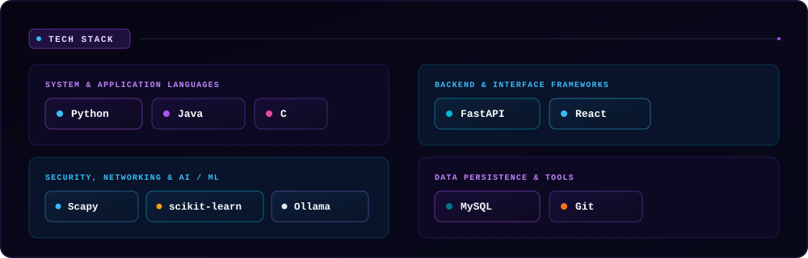
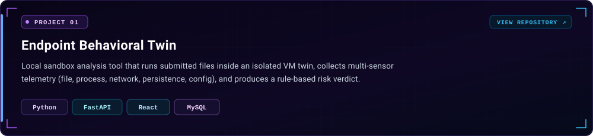
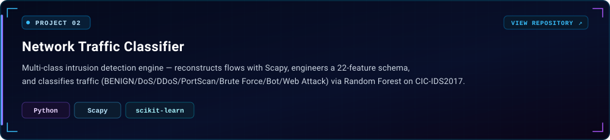
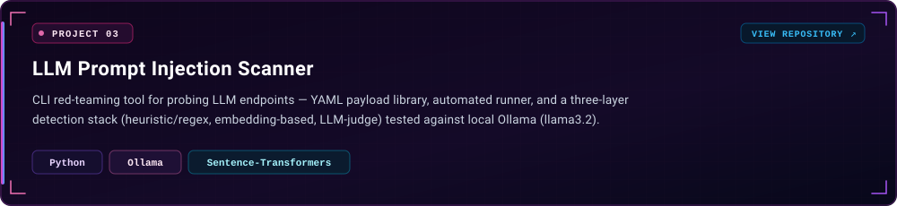
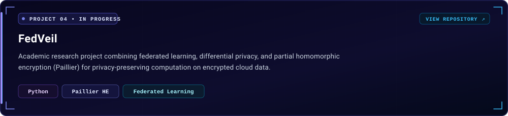

<!-- HERO BANNER -->

  

<!-- ABOUT ME SECTION -->

  

<!-- TECH STACK SECTION -->

  

<!-- FEATURED PROJECTS HEADER -->

 

<!-- PROJECT 01: ENDPOINT BEHAVIORAL TWIN -->

  

<!-- PROJECT 02: NETWORK TRAFFIC CLASSIFIER -->

  

<!-- PROJECT 03: LLM PROMPT INJECTION SCANNER -->

  

<!-- PROJECT 04: FEDVEIL -->

  

<!-- FOOTER & CONNECT -->

 

  
  &nbsp;&nbsp;&nbsp;&nbsp;
  

